# Hi! I'm Nayana 🤓

  

  
  
  
  

---

## About Me:

- B.Tech Computer Science Student

- Interested in Full-Stack Development, AI, and Problem Solving

- Active participant in Hackathons and Technical Competitions

- Exploring Machine Learning, Cloud Technologies, and System Design

- Open to collaborating on innovative projects

---

## GitHub Metrics:

  

---

## Featured Projects:

### Stampede Detector

Real-time crowd density monitoring and prediction system.

* Live video analysis
* Crowd risk prediction
* AI-powered safety monitoring

### Voice-Controlled Local AI Agent

A privacy-focused AI assistant that processes spoken commands and executes tasks locally using speech recognition and large language models.

* Supports real-time microphone input and audio file uploads
* Uses Whisper for accurate speech-to-text transcription
* Hybrid intent detection using rule-based logic and Ollama-hosted LLMs
* Generates code, creates files, and summarizes text automatically
* Secure local execution with restricted file operations
* Interactive Streamlit interface with real-time pipeline visualization

### ATHENIS

AI-powered legal document simplifier built for HackOdisha 5.0.

* Simplifies legal language into understandable text
* Uses AI for document analysis
* Top 10 Finish at HackOdisha 5.0

### Braillink

Assistive Braille phone cover designed to improve accessibility.

* Braille output mechanism
* Hardware-software integration
* Accessibility-focused innovation

### WHYBOT - Recursive Help Desk

A parody AI support system that responds with increasingly complex solutions.

* FastAPI backend
* Gemini integration
* Recursive AI-generated responses

---

# Technologies:

---

# GitHub Stats:

  
  

  

---

# Connect With Me:

  
  

---

  <i>Building impactful technology through curiosity, creativity, and continuous learning.</i>

